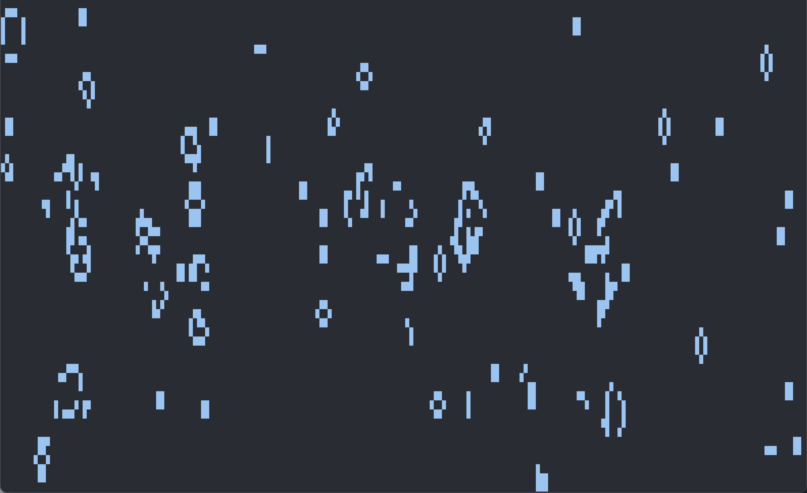

# game-of-life
Conway's game of life implemented within rust

## To install do:

```sh
    git clone https://github.com/twilight0963/conway-gol
    cd ~/conway-gol
    cargo install --path .
```

## Then run:

```sh
game-of-life
```

### You can also specify a chance of a cell initially being populated, and the target FPS:

```sh
# To give a 50% chance of a cell being alive on initial frame:
game-of-life 0.5
```

```sh
# To give a 50% chance of cell being alive on initial frame at 60FPS
game-of-life 0.5 60
```

### Default

```sh
# INIT POPULATION CHANCE -> 0.1
# TARGET FPS -> 24
game-of-life 0.1 24
```

**Note**: 
- Value for initial population chance must be between 0 and 1.
- Value for FPS must be a natural number 

Exit by pressing `q`!

## Screenshot:

--- 



