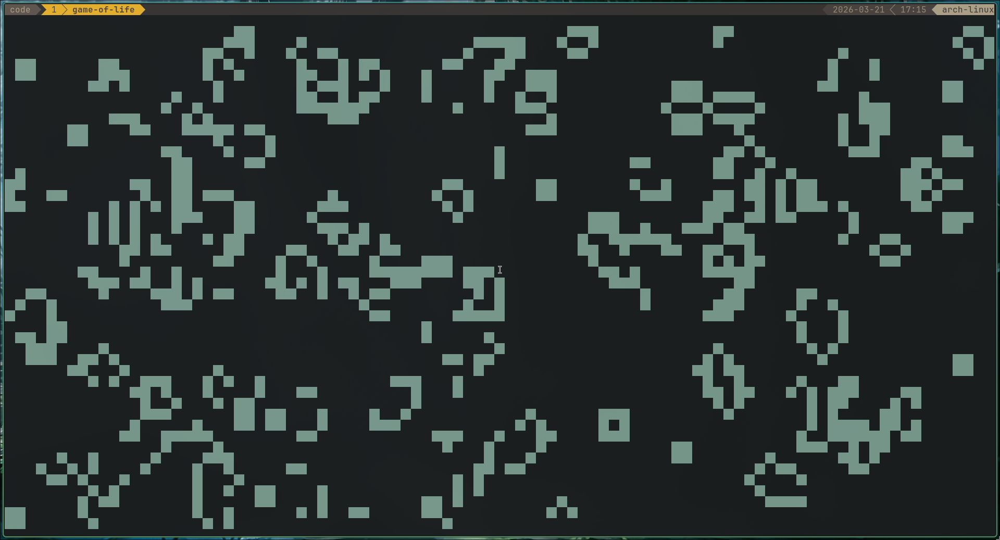
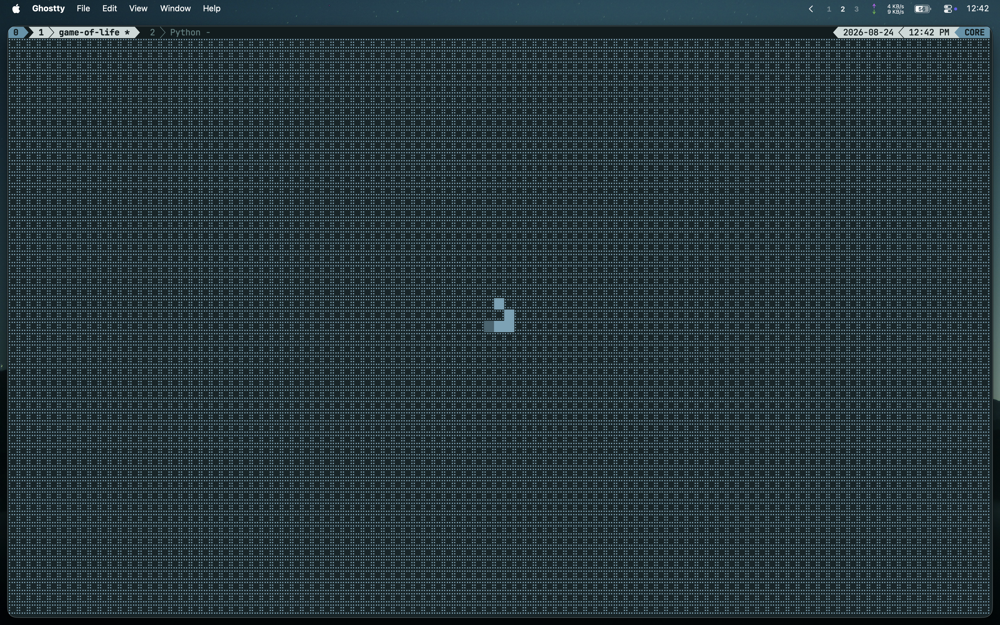

# game-of-life

Conway's game of life implemented within rust

## Installation:

```sh
cargo install --git https://github.com/twilight0963/conway-gol
```

or

```sh
git clone https://github.com/twilight0963/conway-gol
cd ~/conway-gol
cargo install --path .
```

## Then run:

```sh
game-of-life
```

### You can open an editor for initial frame by passing the `c` argument

```sh
game-of-life c
```

### You can also specify a chance of a cell initially being populated, and the target FPS:

```sh
# To give a 50% chance of a cell being alive on initial frame:
game-of-life 0.5
```

```sh
# To give a 50% chance of cell being alive on initial frame at 60FPS
game-of-life 0.5 60
```

### Default values

```sh
# INIT POPULATION CHANCE -> 0.1
# TARGET FPS -> 24
game-of-life 0.1 24
```

### Help function can be invoked via:

```sh
game-of-life -h
```

or

```sh
game-of-life --help
```

**Note**:

- Value for initial population chance must be between 0 and 1, or `c` to open the editor.
- Value for FPS must be a natural number

## Keybinds:

- In Editor:
  - Arrow keys - Move cursor
  - Enter - Birth/Kill cell
  - Spacebar - Begin simulation
- In simulation:
  - q - Exit simulation

## Screenshots:

---




